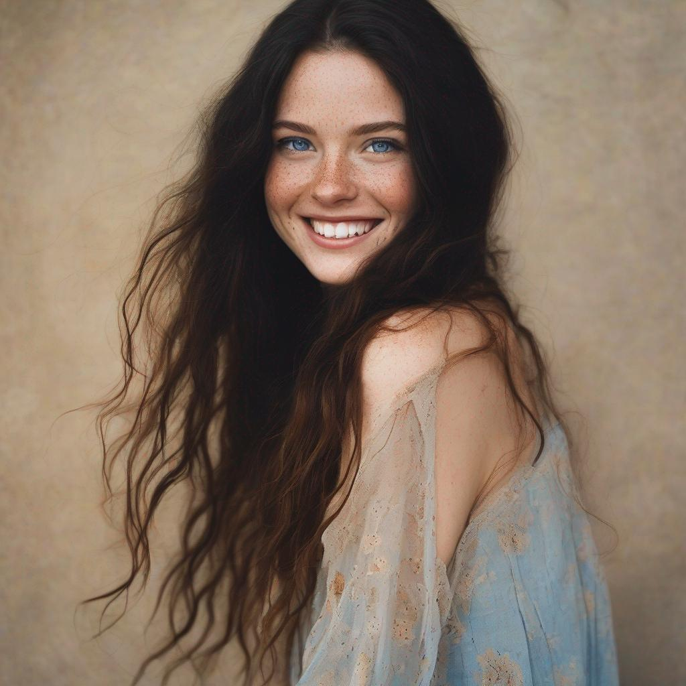

# Command line SDXL

Python 3.11 is required.

To setup and run as a python venv, run the localrun.sh command.

the -d mps is for apple silicon, for cuda specify -d cuda, or -d cpu (which is default without the switch)

```console
./localrun.sh -d mps -p "beautiful lady, (freckles), big smile, blue eyes, long dark hair, dark makeup, hyperdetailed photography, soft light, head and shoulders portrait, cover" -n "(worst quality, low quality, normal quality, lowres, low details, oversaturated, undersaturated, overexposed, underexposed, grayscale, bw, bad photo, bad photography, bad art:1.4), (watermark, signature, text font, username, error, logo, words, letters, digits, autograph, trademark, name:1.2), (blur, blurry, grainy), morbid, ugly, asymmetrical, mutated malformed, mutilated, poorly lit, bad shadow, draft, cropped, out of frame, cut off, censored, jpeg artifacts, out of focus, glitch, duplicate, (airbrushed, cartoon, anime, semi-realistic, cgi, render, blender, digital art, manga, amateur:1.3), (3D ,3D Game, 3D Game Scene, 3D Character:1.1), (bad hands, bad anatomy, bad body, bad face, bad teeth, bad arms, bad legs, deformities:1.3)"
```

[](examples/lady.jpg)


You can add in also refiner (-r), and refiner samples. (-S)

-o for output folder, default is output_images in folder of script

The Dockerfile is experimental
